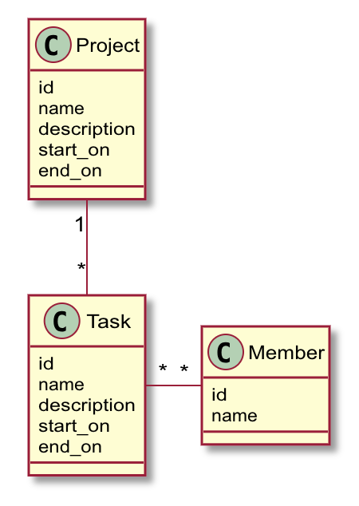
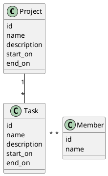

# Rails PostgreSQL sample

## Model


<!--

-->

## Scaffolding

```bash
$ bundle exec rails g scaffold Project name:string description:text start_on:date end_on:date
$ bundle exec rails g scaffold Task project:references name:string description:text status:integer start_on:date end_on:date
$ bundle exec rails g scaffold Member name:string description:text
```

This README would normally document whatever steps are necessary to get the
application up and running.

Things you may want to cover:

* Ruby version

* System dependencies

* Configuration

* Database creation

* Database initialization

* How to run the test suite

* Services (job queues, cache servers, search engines, etc.)

* Deployment instructions

* ...
